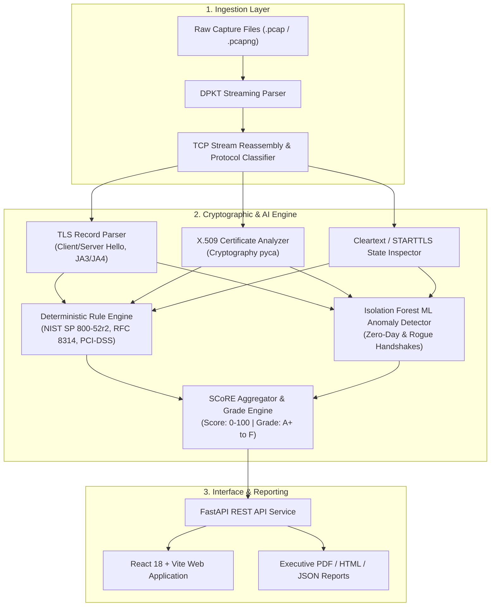

# SecureMailScope 🛡️✉️

> **AI-Assisted Cryptographic Security Posture Assessment for Secure Email Communications**  
> *Smart India Hackathon (SIH) — Problem Statement ID: 26159*

[](https://python.org)
[](https://fastapi.tiangolo.com)
[](https://react.dev)
[](https://www.typescriptlang.org)
[](https://vitejs.dev)
[](https://tailwindcss.com)
[](https://www.docker.com)
[](LICENSE)

---

## 📌 Executive Overview

**SecureMailScope** is an offline, non-intrusive, passive network analysis and cryptographic posture scoring platform tailored specifically for email transport infrastructure (**SMTP**, **SMTPS**, **POP3**, **POP3S**, **IMAP**, and **IMAPS**). 

By analyzing raw network packet captures (`.pcap` / `.pcapng`), SecureMailScope inspects application handshakes and TLS records without intercepting or decrypting payload content. It computes a deterministic **Security Cryptographic Rating Evaluation (SCoRE)**, uncovers active MITM attacks (such as **STARTTLS stripping**), evaluates compliance against strict cybersecurity baselines, uses an **Isolation Forest ML model** to detect zero-day anomalies and malicious client fingerprints (JA3/JA4), and generates multi-format executive/audit reports.

---

## 🚀 Key Features

- 🔍 **Passive PCAP Parsing & Stream Reassembly**: Zero network overhead or active probing. Uses high-performance packet decoding (`dpkt`) to reconstruct bi-directional email sessions and TLS handshakes.
- 🛑 **STARTTLS Stripping & Downgrade Detection**: Detects MITM tampering where attackers strip `250-STARTTLS` or `STLS` capabilities to force cleartext transmission.
- 🔐 **Deep Cryptographic Assessment**: Audits TLS protocol versions (SSLv3 up to TLS 1.3), cipher suites (e.g., Sweet32 3DES, RC4, CBC mode, forward secrecy with (EC)DHE), and X.509 certificate chains (expiry, weak keys, self-signed, untrusted CAs).
- 🤖 **AI/ML Anomaly Scorer**: Unsupervised Machine Learning (**Isolation Forest**) evaluates multi-dimensional TLS handshake features (cipher count, extension entropy, key exchange strength, JA3 hash deviations) to surface stealthy anomalous clients.
- 📊 **Dynamic SCoRE Engine (0–100 & Grades A+ to F)**: Transparent formula-based scoring:
  $$\text{SCoRE} = \max\left(0, \min\left(100, \text{Base Score} - \text{Rule Deductions} + \text{Bonuses} - \text{Uncertainty Penalty}\right)\right)$$
- 📋 **Regulatory Compliance Mapping**: Live mapping against **NIST SP 800-52r2**, **RFC 8996** (TLS 1.0/1.1 deprecation), **RFC 8314** (Cleartext obsolete in email), **PCI-DSS v4.0**, and **HIPAA**.
- 📄 **Multi-Format Reporting Engine**: One-click generation of **HTML**, **PDF**, and structured **JSON** audit reports.
- ⚡ **Modern Gallery-Grade UI**: Built with React 18, TypeScript, Tailwind CSS, Lucide icons, and Anime.js animated network security visualizations.

---

## 🏗️ Architecture & Data Pipeline



---

## 🧪 Pre-Bundled Synthetic Scenarios (PCAPs)

The backend comes pre-loaded with synthetic PCAP captures demonstrating real-world attack scenarios and configurations:

| Scenario / Filename | Description | Expected Grade |
|---|---|:---:|
| `starttls_stripping_attack.pcap` | Active MITM adversary stripping STARTTLS from SMTP handshake; credentials leaked in cleartext | **F (Critical)** |
| `legacy_sslv3_rc4_mail.pcap` | Legacy POP3S session with deprecated SSLv3 and broken RC4 stream cipher | **F (Critical)** |
| `tls10_sweet32_des_session.pcap` | IMAPS traffic using TLS 1.0 with 3DES-EDE-CBC cipher (vulnerable to Sweet32) | **D (High Risk)** |
| `expired_weak_rsa1024_cert.pcap` | SMTPS session using an expired certificate with weak RSA 1024-bit key | **D (High Risk)** |
| `plaintext_smtp_credentials_leak.pcap` | Raw unencrypted SMTP session (Port 25) transmitting authentication in plain text | **F (Critical)** |
| `anomalous_ja3_malicious_mailer.pcap` | Malicious spam bot / custom TLS fingerprint flagged by ML Isolation Forest | **C (Medium Risk)** |
| `modern_hardened_tls13_mail.pcap` | Hardened modern SMTPS using TLS 1.3 with AES-256-GCM, ECDHE, and valid certificate | **A+ (Optimal)** |
| `enterprise_mixed_traffic_500mb_sim.pcap` | Multi-session enterprise baseline simulation mixing compliant & non-compliant flows | **B (Moderate)** |

---

## 💻 Local Development Setup

### Prerequisites
- **Python**: 3.10 or 3.11+
- **Node.js**: 18.x or 20.x+ (`npm` or `pnpm` or `yarn`)

---

### Step 1: Backend Setup (FastAPI)

```bash
# 1. Navigate to backend directory
cd backend

# 2. Create a Python virtual environment
python -m venv .venv

# 3. Activate virtual environment
# On Windows (PowerShell):
.venv\Scripts\Activate.ps1
# On Linux / macOS:
source .venv/bin/activate

# 4. Install dependencies
pip install -r requirements.txt

# 5. Start the backend development server
uvicorn app.main:app --host 0.0.0.0 --port 8000 --reload
```
> 📍 Backend will be live at: **`http://localhost:8000`**  
> 📑 Interactive Swagger API docs: **`http://localhost:8000/docs`**

---

### Step 2: Frontend Setup (React + Vite)

```bash
# 1. Open a new terminal and navigate to frontend directory
cd frontend

# 2. Install dependencies
npm install

# 3. Start Vite dev server
npm run dev
```
> 🌐 Frontend will be live at: **`http://localhost:5173`** (or displayed local port)

---

## 🐳 Deployment Guide

### Option 1: Docker & Docker Compose (Recommended)

Deploy the entire full-stack application with a single command:

```bash
# Clone repository if needed
git clone <repository-url>
cd 159-prototype

# Build and launch all services in background
docker compose up --build -d
```

- **Frontend & App Entry**: `http://localhost` (Port 80 or `http://localhost:3000`)
- **Backend API**: `http://localhost:8000`
- **Health Check**: `http://localhost:8000/api/health`

To stop the containers:
```bash
docker compose down
```

---

### Option 2: Cloud PaaS Deployment (Render / Railway / Fly.io / Heroku)

#### 1. Backend Deployment (e.g. Render / Railway):
- **Build Command**: `pip install -r requirements.txt`
- **Start Command**: `uvicorn app.main:app --host 0.0.0.0 --port $PORT`
- **Root Directory**: `backend`
- **Environment Variables**:
  - `PORT=8000` (or injected automatically by platform)

#### 2. Frontend Deployment (e.g. Vercel / Netlify / Cloudflare Pages):
- **Framework Preset**: Vite
- **Root Directory**: `frontend`
- **Build Command**: `npm run build`
- **Output Directory**: `dist`
- **Environment Variables**:
  - `VITE_API_BASE=https://your-backend-service.onrender.com/api`

---

### Option 3: Production Linux VM (Ubuntu / Debian + Nginx + Systemd)

#### 1. Configure Systemd Backend Service:
Create `/etc/systemd/system/securemailscope.service`:
```ini
[Unit]
Description=SecureMailScope FastAPI Backend
After=network.target

[Service]
User=www-data
WorkingDirectory=/var/www/securemailscope/backend
ExecStart=/var/www/securemailscope/backend/.venv/bin/uvicorn app.main:app --host 127.0.0.1 --port 8000 --workers 4
Restart=always

[Install]
WantedBy=multi-user.target
```

Enable and start:
```bash
sudo systemctl daemon-reload
sudo systemctl enable --now securemailscope
```

#### 2. Configure Nginx Reverse Proxy:
Create `/etc/nginx/sites-available/securemailscope`:
```nginx
server {
    listen 80;
    server_name yourdomain.com;

    # Serve compiled frontend assets
    location / {
        root /var/www/securemailscope/frontend/dist;
        index index.html;
        try_files $uri $uri/ /index.html;
    }

    # Proxy API calls to FastAPI backend
    location /api/ {
        proxy_pass http://127.0.0.1:8000/api/;
        proxy_set_header Host $host;
        proxy_set_header X-Real-IP $remote_addr;
        proxy_set_header X-Forwarded-For $proxy_add_x_forwarded_for;
        proxy_set_header X-Forwarded-Proto $scheme;
        client_max_body_size 50M;
    }
}
```
Enable site and reload Nginx:
```bash
sudo ln -s /etc/nginx/sites-available/securemailscope /etc/nginx/sites-enabled/
sudo nginx -t && sudo systemctl reload nginx
```

---

## 📡 API Reference Overview

| Method | Endpoint | Description |
|---|---|---|
| `GET` | `/api/health` | Healthcheck & system version metadata |
| `GET` | `/api/captures` | List all available captures with summary scores |
| `GET` | `/api/captures/{id}` | Get full details & posture assessment for a capture |
| `POST` | `/api/captures/upload` | Upload and analyze a custom `.pcap` / `.pcapng` file |
| `GET` | `/api/captures/{id}/download` | Download raw binary PCAP capture file |
| `POST` | `/api/captures/reset-samples` | Reset the repository synthetic test captures |
| `GET` | `/api/captures/{id}/sessions` | List and filter reconstructed email protocol sessions |
| `GET` | `/api/captures/{id}/sessions/{s_id}` | Detailed session view (handshakes, ciphers, certs) |
| `GET` | `/api/captures/{id}/analytics/summary` | Executive metrics, SCoRE breakdown & compliance |
| `GET` | `/api/captures/{id}/analytics/anomalies`| ML anomaly detections & heuristic alerts |
| `GET` | `/api/rules` | Complete rule catalog with severity & remediation guidance |
| `GET` | `/api/captures/{id}/report.html` | Download / view audit report in standalone HTML format |
| `GET` | `/api/captures/{id}/report.json` | Download structured machine-readable JSON report |
| `GET` | `/api/captures/{id}/report.pdf` | Download formatted PDF security audit report |

---

## 📂 Project Structure

```
159-prototype/
├── .gitignore                   # Unified repository gitignore
├── .dockerignore                # Docker ignore definitions
├── docker-compose.yml           # Multi-container orchestration
├── README.md                    # Project documentation
├── backend/
│   ├── Dockerfile               # Production container for FastAPI backend
│   ├── requirements.txt         # Python dependencies
│   ├── sample_pcaps/            # Pre-bundled synthetic attack PCAP files
│   └── app/
│       ├── main.py              # FastAPI app entrypoint & middleware
│       ├── core/                # Configuration & SCoRE constants
│       ├── api/                 # REST routes (captures, sessions, analytics, reports)
│       ├── engine/              # Core packet parsing, TLS, cert & ML scoring engine
│       │   ├── pcap_parser.py   # DPKT packet & TCP reassembly engine
│       │   ├── tls_parser.py    # Client/Server Hello & cipher suite extractor
│       │   ├── cert_analyzer.py # X.509 certificate validation
│       │   ├── rule_engine.py   # Deterministic compliance rule matcher
│       │   ├── ml_scorer.py     # Isolation Forest anomaly detector
│       │   └── score_evaluator.py# SCoRE computation matrix
│       ├── generator/           # Synthetic PCAP attack generator
│       └── reports/             # HTML / PDF / JSON report generation builders
└── frontend/
    ├── Dockerfile               # Multi-stage production container with Nginx
    ├── nginx.conf               # Frontend Nginx SPA & reverse proxy config
    ├── package.json             # NPM dependencies & scripts
    ├── vite.config.ts           # Vite build configuration
    ├── tailwind.config.js       # Design system tokens & typography
    └── src/
        ├── components/          # Reusable UI cards, tables, modal & visuals
        ├── pages/               # Landing, Dashboard, Sessions, Rules, Analytics
        ├── services/            # API client layer with dynamic base URL support
        └── types/               # TypeScript data models & interfaces
```

---

## 📜 Compliance Standards Reference

- **NIST SP 800-52 Rev. 2**: *Guidelines for the Selection, Configuration, and Use of TLS Implementations*
- **RFC 8314**: *Cleartext Considered Obsolete: Use of Transport Layer Security (TLS) for Email Submission and Access*
- **RFC 8996**: *Deprecating TLS 1.0 and TLS 1.1*
- **RFC 7465**: *Prohibiting RC4 Cipher Suites*
- **RFC 7568**: *Deprecating Secure Sockets Layer Version 3.0*
- **PCI-DSS v4.0 (Req 4.1)**: *Protect Cardholder Data with Strong Cryptography during Transmission*
- **HIPAA 45 CFR § 164.312(e)(1)**: *Technical Safeguards — Transmission Security*

---

## ⚖️ License

Distributed under the **MIT License**. See `LICENSE` for more information.
